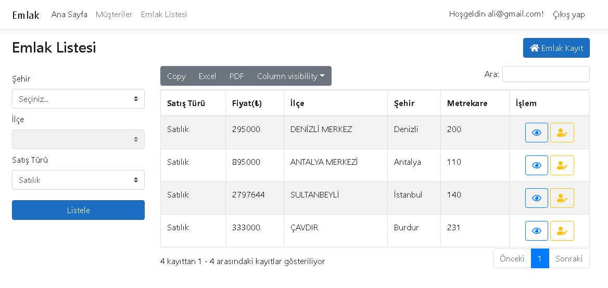
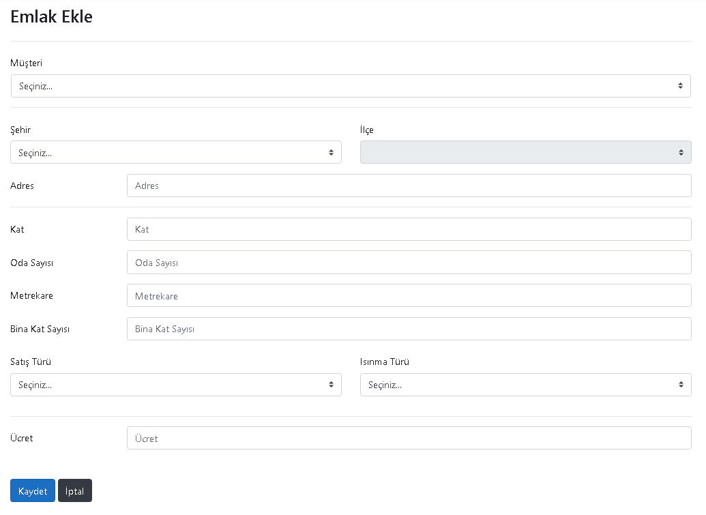
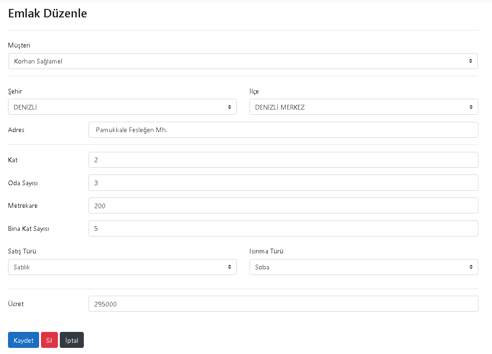
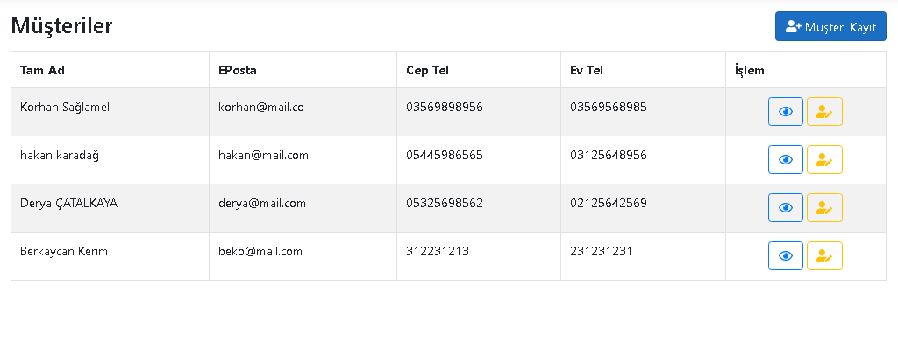
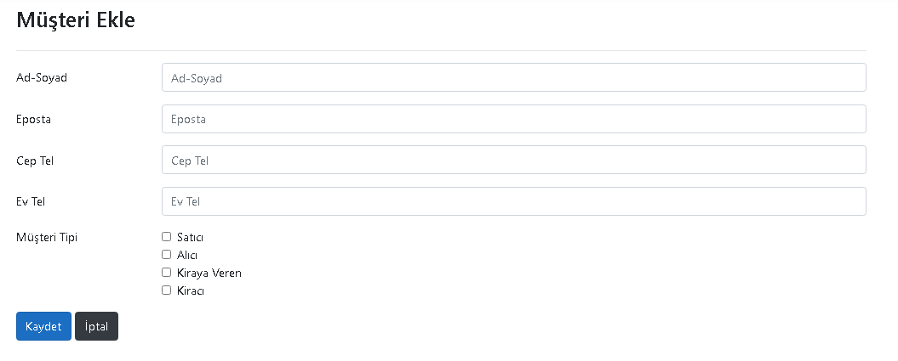
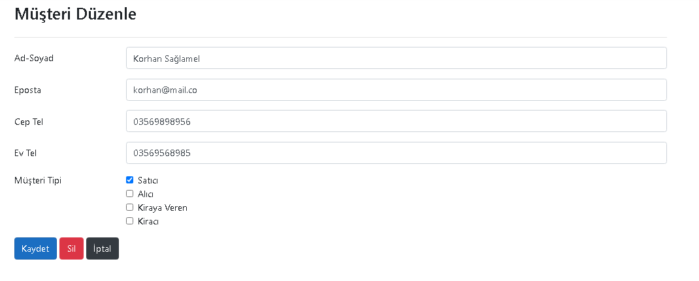
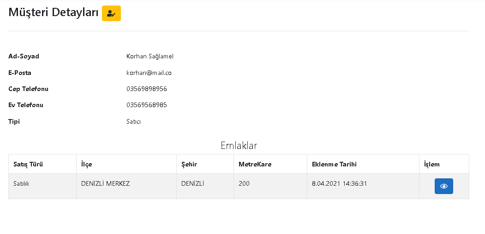

# RealEstate
.Net Core 3.1 ile yazılan, katmanlı mimariye uygun Emlak Uygulaması

## Emlak Listesi Sayfası  
     
   

## Emlak Ekleme Sayfası  
     
   
 
 ## Emlak Düzenleme Sayfası  
     
   
 
## Emlak Detayları Sayfası  
     
   
 
 ## Müşteri Listesi Sayfası  
     
   
 
  ## Müşteri Ekleme Sayfası  
     
   
 
  ## Müşteri Düzenleme Sayfası  
     
   
 
  ## Müşteri Detayları Sayfası  
      
 
